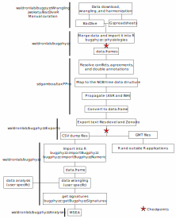

# `bugphyzz` | bacterial physiologies

<!-- badges: start -->

[](https://www.tidyverse.org/lifecycle/#experimental)
[](https://CRAN.R-project.org/package=bugphyzz)
<!-- badges: end -->
 
`bugphyzz` is a collection of bacterial physiological features to be used as a
resource for physiological discovery and producing signatures.
We are continuously curating `bugphyzz` databases through 3 main methods:
webscraping, bulk download from online databases, and manual curation from
literature. Mainly this database was concieved for analyzing microbiome data
using physiological information. `Bugphyzz` can allow a user to look at
specific physiologies, and create signature sets with specific bugs. The
uniform structure of the data is what allows for the latter to manifest.

We curated attributes like Gram stain, optimal temperature, fermentation,
respiration, size, shape, colony arrangement, and 27 more physiologies.
`bugphyzz` is now accessible via direct download or through our
[R package](https://github.com/waldronlab/bugphyzz/edit/main/README.md#installation).

Here, you can find installation instructions, examples of creating signatures,
`bugphyzz`[analyses](https://github.com/waldronlab/bugphyzz/edit/main/README.md#bugphyzzanalyses) and how to add your own curation to the database.

## Installation

You can install the development version of bugphyzz with:

```r
if (!require("BiocManager", quietly = TRUE))
    install.packages("BiocManager")

## Devel version
BiocManager::install("waldronlab/bugphyzz")
```

## bugphyzzAnalyses

Example analyses using data from this package can be found at https://waldronlab.io/bugphyzzAnalyses/

## Reference for Gene ontology evidence codes

http://geneontology.org/docs/guide-go-evidence-codes/

## Reference for frequency keywords

https://grammarist.com/grammar/adverbs-of-frequency/

## How to add a new attribute in GitHub to the bugphyzz database
Curation steps:
 1. Add attributes of physiology to [Attributes](https://github.com/waldronlab/bugphyzz/blob/main/inst/extdata/attributes.tsv) using ontology terms
 2. Add reference(s) to [Confidence in Curation](https://github.com/waldronlab/bugphyzz/blob/main/inst/extdata/confidence_in_curation.tsv)

If using Google Sheets, publish a csv file to web:

 4. Add Google Doc "publish to web" link and add in [Link](https://github.com/waldronlab/bugphyzz/blob/main/inst/extdata/links.tsv)
 5. Add Google Doc link to [Source Link](https://github.com/waldronlab/bugphyzz/blob/main/inst/extdata/source_links.tsv)


## Bugphyzz worklfow


