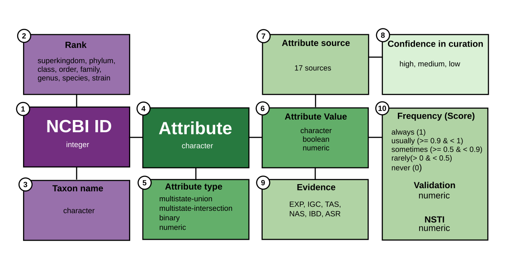

```{r, include = FALSE}
knitr::opts_chunk$set(
  collapse = TRUE,
  comment = "#>"
)
```

## Introduction

[Bugphyzz](https://github.com/waldronlab/bugphyzzExports)
is an electronic resource of harmonized microbial annotations from
different sources. These annotations can be used to create signatures of
microbes sharing attributes and used for bug set enrichment analysis.

## Data schema

Annotations in bugphyzz represent the link between a taxon (Bacteria/Archaea)
and an attribute as described in the data schema below.

<center>

{height="300px" width="600px"}

</center>

**Taxon-related**

Taxonomic data was harmonized according to the NCBI taxonomy:

1. _NCBI ID_. An integer. The NCBI taxonomy ID (taxid) associated with a 
taxon.
2. _Rank_. A character string describing the taxonomy rank. Valid values:
superkingdom, kingdom, phylum, class, order, family, genus, species, strain.
3. _Taxon name_. A character string describing the scientific name of the taxon.

**Attribute-related**

Attribute data was harmonized with a controlled vocabulary based on
available ontology terms. Attributes, ontology terms, and ontology libraries
can be found in the 'Attribute and sources' vignette.

4. _Attribute_. A character string describing the name of a trait that can be
observed or measured.
5. _Attribute type_. A character string describing the data type.
    * numeric. Attributes that can take numeric values. For example, attribute:
    growth temperature; attribute value: 25 C.
    * binary. Attributes that can take booleans. For example,
    attribute: butyrate-producing; attribute value: TRUE.
    * multistate-intersection. A set of related binary attributes. For example,
    habitat.
    * multistate-union. Attribute that can take three or more values. These
    values are always character strings. For example, attribute: aerophilicity;
    attribute values: aerobic, anaerobic, or facultatively anaerobic.
6. *Attribute value*. The values that an attribute could take. Either a
character string, a boolean, or a number.

**Attribute value-related**

Metadata associated with the attribute values:

7. _Attribute source_. The source of the information.
8. _Evidence_. The type of evidence that supports an annotation. Valid options:
    * EXP = experiment.
    * IGC = inferred from genomic context.
    * TAS = traceable author statement.
    * NAS = non-traceable author statement.
    * IBD = inferred from biological aspect of descendant.
    * ASR = ancestral state reconstruction.
    
9. _Support values_.
    * Frequency and Score. Confidence that a given taxon exhibits a trait based
    on the curator’s knowledge or results of ASR or IBD.
    * Validation. Score of the [10-fold cross-validation analysis](https://github.com/waldronlab/taxPProValidation).
    Matthews correlation coefficient (MCC) for discrete attributes and 
    R-squared for numeric attributes. Default threshold value is 0.5 and above.
    * NSTI. Nearest sequence taxon index as described in
    [PICRUSt](https://doi.org/10.1038/nbt.2676) or the
    [castor](https://cran.r-project.org/web/packages/castor/index.html) package.
    Relevant for numeric values only.

**Attribute source-related**

10. _Confidence in curation_. A character string describing the confidence
value of a source based on three criteria: 1) it has a source, 2) it has valid
references, and 3) the curation was peer-reviewed.
Valid options: high, medium, or low, used when a source satisfied three, two,
or one of these criteria.

**More information**

+ Description of **sources** and **attributes** can be found here:
https://waldronlab.io/bugphyzz/articles/attributes.html

+ Description of ontology **evidence** codes (8) can be found here:
https://geneontology.org/docs/guide-go-evidence-codes/

+ Description of **frequency** keywords and scores is based on:
https://grammarist.com/grammar/adverbs-of-frequency/

+ IBD and ASR were performed with taxPPro:
https://github.com/waldronlab/taxPPro

## Analysis and Stats

This vignette only covers the main use of bugphyzz. Detailed analysis and
stats of the bugphyzz annotations can be found here:
https://github.com/waldronlab/bugphyzzAnalyses

## Installation

The bugphyzz package can be installed with:

```{r, eval=FALSE}
if (!require("BiocManager", quietly = TRUE))
    install.packages("BiocManager")

## Devel version
BiocManager::install("waldronlab/bugphyzz")
```

## Import bugphyzz

Load bugphyzz and other packages:

```{r load package, message=FALSE}
library(bugphyzz)
library(dplyr)
library(purrr)
```

bugphyzz is imported with the `importBugphyzz` function as a list of
tidy data.frames, each of them corresponding to an attribute
or group of related attributes in the case of the multistate-union type
(check the data schema description above).

Import bugphyzz and explore available attributes with `names`:

```{r import data, message=FALSE}
bp <- importBugphyzz()
names(bp)
```

Let's take a glimpse at one of the data.frames:

```{r a glimpse}
glimpse(bp$aerophilicity, width = 50)
```

Compare the column names with the data schema described above.

## Create signatures

After the attributes have been imported, we can use the `makeSignatures`
function to create a list of signatures. `makeSignatures` accepts a few
arguments for filtering such as evidence, frequency, and minimum and maximum
values for numeric attributes. If a more refined filtering is required,
a user could use regular data manipulation functions on the data.frame of
interest (e.g., `dplyr::filter`).

Some examples:

+ Create signatures of taxon names at the genus level for the aerophilicity
attribute (discrete):

```{r}
aer_sigs_g <- makeSignatures(
  dat = bp[["aerophilicity"]], tax_id_type = "Taxon_name", tax_level = "genus"
)
map(aer_sigs_g, head)
```

+ Create signatures of taxon names at the species level for the growth
temperature attribute (numeric):

```{r}
gt_sigs_sp <- makeSignatures(
  dat = bp[["growth temperature"]], tax_id_type = "Taxon_name",
  tax_level = 'species'
)
map(gt_sigs_sp, head)
```

+ Create signatures with a custom threshold for the growth temperature
attribute (numeric):

```{r}
gt_sigs_mix <- makeSignatures(
  dat = bp[["growth temperature"]], tax_id_type = "Taxon_name",
  tax_level = "mixed", min = 0, max = 25
)
map(gt_sigs_mix, head)
```

+ Create signatures for the animal pathogen attribute (boolean):

```{r}
ap_sigs_mix <- makeSignatures(
  dat = bp[["animal pathogen"]], tax_id_type = "NCBI_ID",
  tax_level = "mixed", evidence = c("exp", "igc", "nas", "tas")
)
map(ap_sigs_mix, head)
```

+ Make signatures for all of the data.frames:

```{r}
sigs <- map(bp, makeSignatures) |> 
  list_flatten()
length(sigs)
```

```{r}
head(map(sigs, head))
```

## Run an enrichment analysis

Bugphyzz signatures can be used for running enrichment analysis with
existing tools developed in R. For example, using EnrichmenBrowser.

Here is an example of how to run an enrichment analysis using GSEA and
a benchmark dataset.

Load packages:

```{r, message=FALSE}
library(EnrichmentBrowser)
library(MicrobiomeBenchmarkData)
library(mia)
```

Load benchmark data:

```{r, warning=FALSE}
dat_name <- 'HMP_2012_16S_gingival_V35'
tse <- getBenchmarkData(dat_name, dryrun = FALSE)[[1]]
tse_genus <- splitByRanks(tse)$genus
min_n_samples <- round(ncol(tse_genus) * 0.2)
tse_subset <- tse_genus[rowSums(assay(tse_genus) >= 1) >= min_n_samples,]
tse_subset
```

Differential abundance (DA) analysis:

```{r}
tse_subset$GROUP <- ifelse(
  tse_subset$body_subsite == 'subgingival_plaque', 0, 1
)
edger <- deAna(
    expr = tse_subset, de.method = 'edgeR', padj.method = 'fdr', 
    filter.by.expr = FALSE, 
)

dat <- data.frame(colData(edger))
design <- stats::model.matrix(~ GROUP, data = dat)
assay(edger) <- limma::voom(
  counts = assay(edger), design = design, plot = FALSE
)$E
```

Enrichment analysis using GSEA:

```{r, message=FALSE}
gsea <- sbea(
  method = 'gsea', se = edger, gs = aer_sigs_g, perm = 1000,
  alpha = 0.1 
)
gsea_tbl <- as.data.frame(gsea$res.tbl) |> 
  mutate(
    GENE.SET = ifelse(PVAL < 0.05, paste0(GENE.SET, ' *'), GENE.SET),
    PVAL = round(PVAL, 3),
  ) |> 
  dplyr::rename(BUG.SET = GENE.SET)
knitr::kable(gsea_tbl)
```

## Get taxon signatures 

Finally, a user could get all of the signature names to which a given taxon
belongs to. Only taxids should be used.

An example using _Escherichia coli_ (taxid: 562).

Get taxid for _E. coli_ using taxize:

```{r, message=FALSE}
taxid <- as.character(taxize::get_uid("Escherichia coli"))
taxid
```

Get all signature names related to the _E. coli_ taxid:

```{r}
getTaxonSignatures(tax = taxid, bp = bp)
```
## Session information:

```{r}
sessioninfo::session_info()
```
